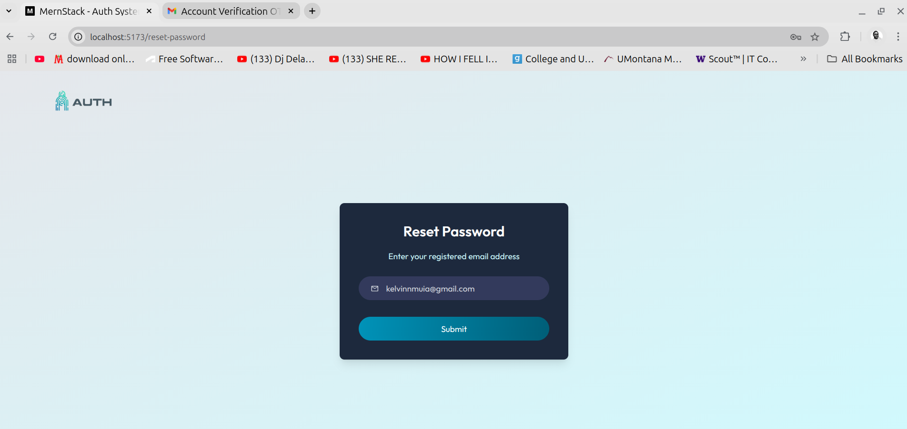

# MERN Stack Authentication System

This is a full-stack authentication system built with the MERN (MongoDB, Express, React, Node.js) stack. It features user authentication, including sign-up, sign-in, password reset, and logout functionality. The system consists of a frontend (client-side) and a backend (server-side), handling authentication using API endpoints and connecting to a MongoDB database.

## Client

The client is a React application that allows users to sign up, log in, and log out. It also includes a protected route that requires authentication to access.

### Getting Started

1. Clone the repository
2. Change into the client directory with `cd client`
3. Install dependencies with `npm install`
4. Start the application with `npm run dev`

### Features

* Homepage with a background image and a header that welcomes users to the platform.
* Navbar with a Login button that redirects users to the sign-in and sign-up forms. 
* Sign-up form with input fields for name, email, and password.
* Sign-in form with input fields for email and password.
* User logout button that logs the user out and redirects them to the homepage.
* Password reset and verification email functionality that sends a password reset OTP to the user's email.
* Protected route that requires authentication to access the page.

### Technologies Used

* React
* React Router
* Axios
* Context API for state management
* Material UI / Tailwind CSS for styling
* React Toastify for notifications

## Server

The server is a Node.js application that provides an API for the client to interact with. It handles user registration, login, and logout, as well as provides a protected route that requires authentication to access.

### Getting Started

1. Clone the repository
2. Change into the server directory with `cd server`
3. Add the following environment variables to `.env` file:
    - `SMTP_SENDER`: The email address used to send emails
    - `SMTP_USER`: The username for the email address
    - `SMTP_PASS`: The password for the email address
    - `MONGODB_URI`: The connection string for the MongoDB database
    - `JWT_SECRET`: The secret key for JWT authentication
    - `NODE_ENV`: The environment variable for development or production
3. Install dependencies with `npm install`
4. Start the application with `npm run server`

### Features

* User registration API endpoint for creating new users in the database.  
* User login API endpoint for authenticating users.
* Email verification OTP API endpoint for sending verification emails to users.
* User logout API endpoint for logging out users.
* Password reset OTP API endpoint for sending password reset emails to users.
* Nodemailer integration for sending email notifications, such as account verification and password reset emails.
* Protected route that requires authentication to access
* JSON Web Token (JWT) token-based authentication

### Technologies Used

* Node.js
* Express framework for building the HTTP(S) server 
* MongoDB with Mongoose library for database interaction 
* Bcrypt for password hashing
* JSON Web Token (JWT) for authentication and session management
* Dotenv for managing environment variables 
* Nodemailer for sending emails

## Screenshots

### Homepage

### Signup form

### Email verification form

### Email verification message

### Filled email verification form

### Success email verification message

### Signin form

### Password reset form

### Password reset popup notification

### Password reset email message

### Filled password reset form

### New password form

